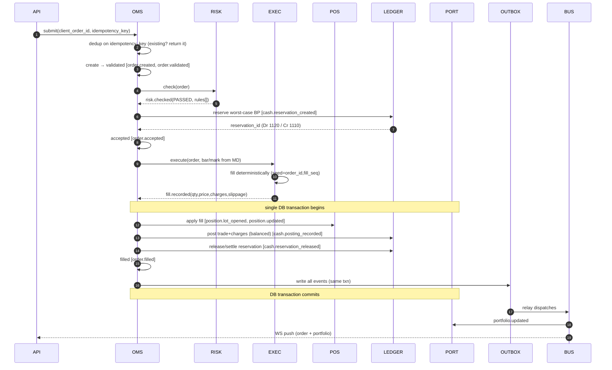
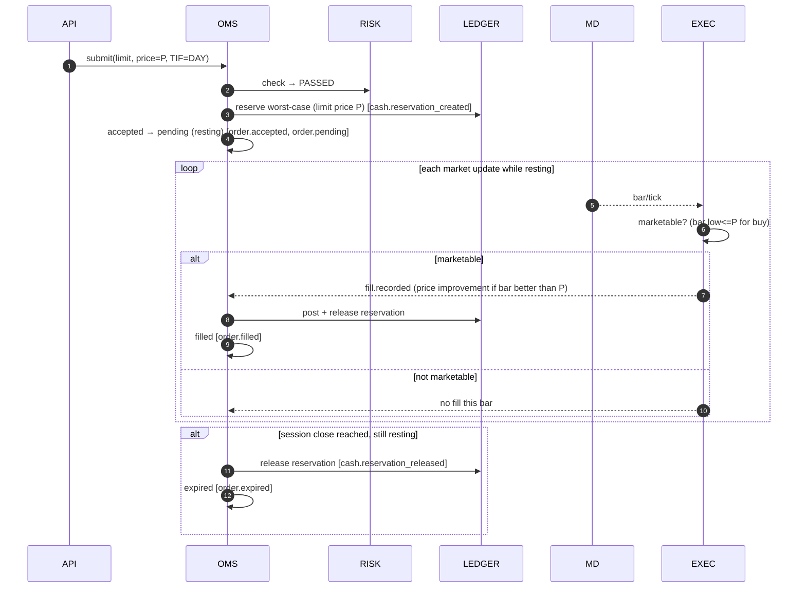
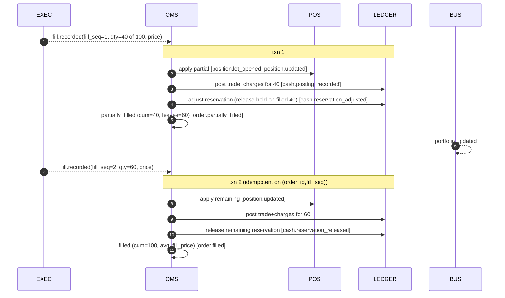
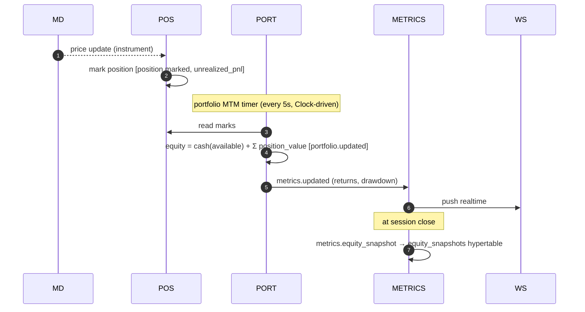
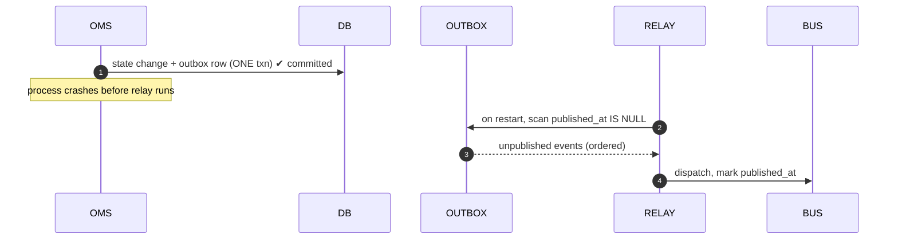
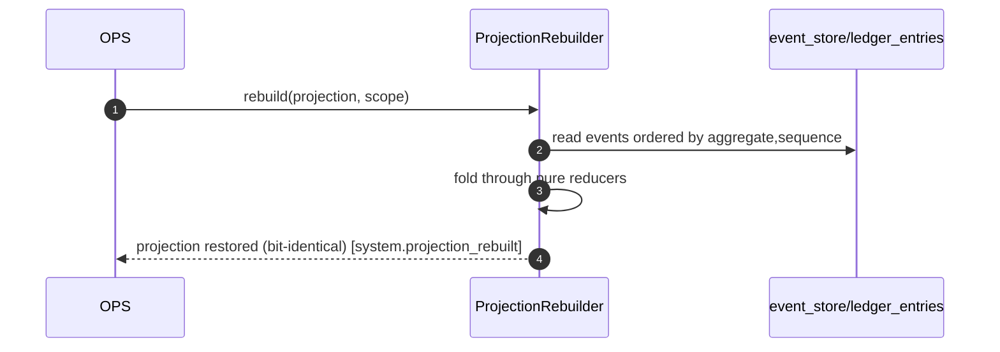
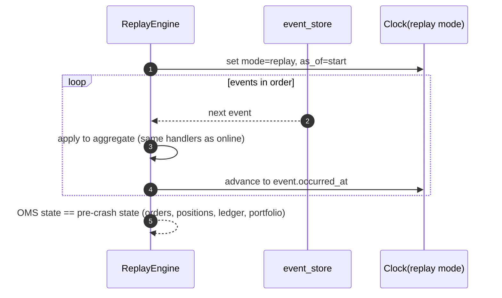

# OMS Event Flows — Sequence Diagrams

**Status:** Approved design · **Phase:** Design-only · **Depends on:** `oms-paper-trading-core.md` §15,
`event-schemas.md`, `ledger-architecture.md`. Diagrams are Mermaid (render in the artifact/GitHub).

> These expand the OMS design's §15 with the approved double-entry ledger, event metadata, reservation model,
> corporate actions, and recovery. Every arrow that crosses a domain boundary is an event (`event-schemas.md`).

Participants (consistent across diagrams):
`API` · `OMS` (Order Service) · `RISK` (Risk Engine gate) · `EXEC` (Execution/Fill Engine) ·
`POS` (Position Mgr) · `LEDGER` (double-entry ledger) · `PORT` (Portfolio Mgr) · `OUTBOX` (transactional
outbox) · `BUS` (relay → Redis/WS + metrics) · `MD` (Market Data).

---

## 1. Market order (happy path)



Invariants: no `accepted` without `risk.checked=PASSED`; no fill applied without the whole state-change txn
committing atomically; reservation always released on terminal state.

---

## 2. Limit order (rests, then fills)



---

## 3. Partial fill (with incremental reservation adjustment)



Guarantee: applying `(order_id, fill_seq)` twice is a no-op (unique constraint + ledger `dedup_key`), so a
retried relay never double-counts a partial.

---

## 4. Order cancellation

```mermaid
sequenceDiagram
  autonumber
  participant API
  participant OMS
  participant LEDGER
  participant BUS
  API->>OMS: cancel(order_id)
  OMS->>OMS: guard: is state cancellable? (created/validated/accepted/pending/partially_filled)
  alt cancellable
    OMS->>LEDGER: release remaining reservation  [cash.reservation_released(reason=cancel)]
    OMS->>OMS: cancelled (keeps any filled qty)  [order.cancelled]
    BUS-->>API: WS push (cancelled)
  else terminal already
    OMS-->>API: 409 conflict (immutable; append audit note only)
  end
```

Race: a cancel arriving concurrently with a fill is resolved by per-aggregate serialization on `sequence` —
whichever commits first wins; the loser re-reads state and either no-ops (already filled) or cancels the
remainder.

---

## 5. Portfolio update / equity snapshot (MTM cadence)

Reflects Decision 4: position MTM per price update; portfolio MTM every 5s; EOD snapshot at close.



Drawdown from `metrics.updated` feeds the Risk Engine's drawdown/daily-loss limits (see risk design).

---

## 6. Corporate-action handling

```mermaid
sequenceDiagram
  autonumber
  participant MD
  participant CA as CorpActionEngine
  participant POS
  participant LEDGER
  participant PORT
  MD-->>CA: corp_action.detected (split/bonus/dividend/buyback, ex_date)
  Note over CA: on ex_date (Clock), before session marks
  alt split / bonus (share-count change, no cash)
    CA->>POS: adjust lots (qty×ratio, cost/share ÷ratio)  [corp_action.applied]
    Note over LEDGER: no value entry (1210 cost unchanged); memo posting for audit
  else cash dividend
    CA->>LEDGER: post Dr 1110 / Cr 4200 (amount×qty on record date)  [corp_action.cash_posted]
  else buyback / special cash
    CA->>POS: reduce accepted lots (if tendered)  [corp_action.applied]
    CA->>LEDGER: post cash + realized P&L legs
  end
  CA->>PORT: recompute exposure/value  [portfolio.updated]
```

Consistency with ADR 0005: market-data prices are already split/bonus adjusted upstream; the OMS corporate
action only adjusts **held quantities/cost basis**, never re-applies price adjustments — avoiding the
double-adjustment class of bug.

---

## 7. Recovery after failure

Three failure classes, each with a deterministic recovery from the append-only log.

### 7.1 Crash between state change and event dispatch (outbox drains)

No event is lost because the outbox row committed atomically with the state change. Consumers are idempotent,
so re-dispatch of an already-seen `event_id` is a no-op.

### 7.2 Projection corruption / drift


### 7.3 Full-state reconstruction (event replay)

Because handlers are pure and time comes from the Clock, replay is deterministic: same events ⇒ same state.
This underpins bug reproduction, AI-decision replay, and day-replay validation.

---

## 8. Cross-cutting guarantees illustrated above
| Guarantee | Where enforced in the flows |
|---|---|
| Risk gate mandatory | §1/§2: `accepted` only after `risk.checked=PASSED` |
| Atomic state+event | §1/§3/§7.1: single DB txn writes state change + outbox row |
| Exactly-once effect | idempotent consumers keyed on `event_id` / `(order_id,fill_seq)` / ledger `dedup_key` |
| Reservation lifecycle | §1–§4: created on accept, adjusted on partial, released on terminal |
| No double-adjustment | §6: OMS adjusts qty/cost only; prices pre-adjusted upstream (ADR 0005) |
| Deterministic replay | §7.3: pure handlers + Clock |
