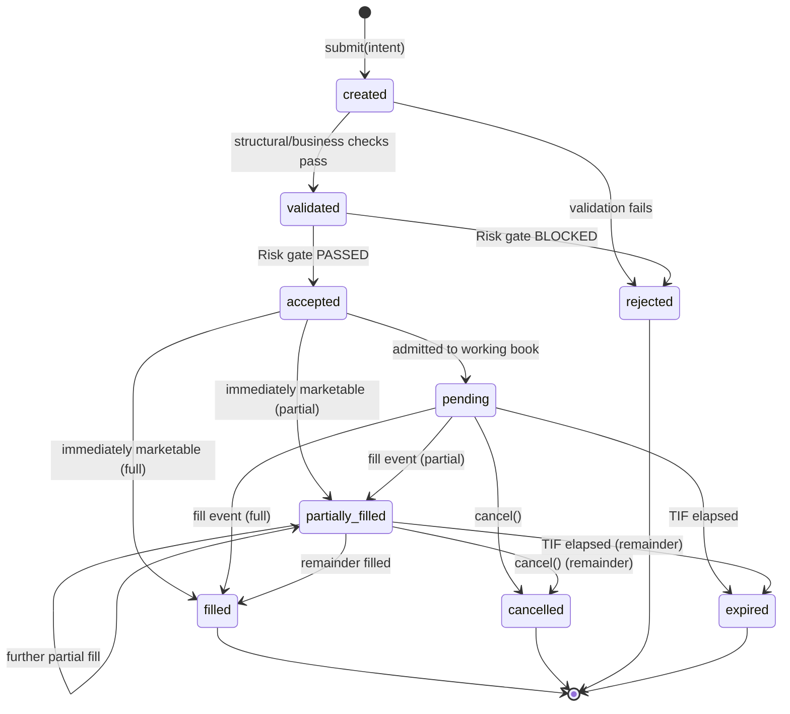
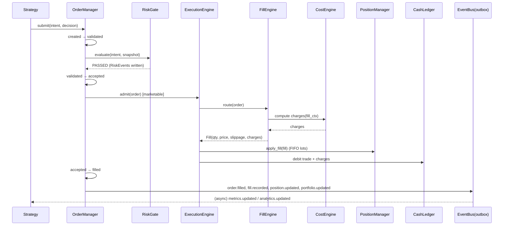
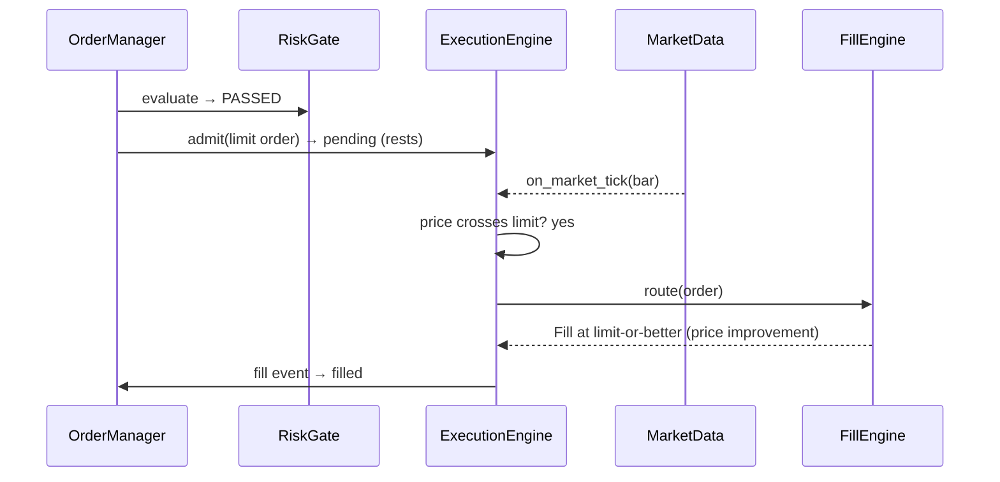
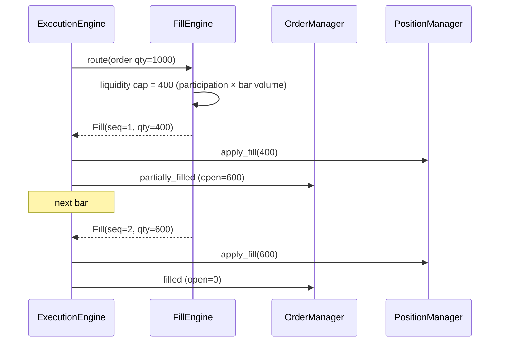
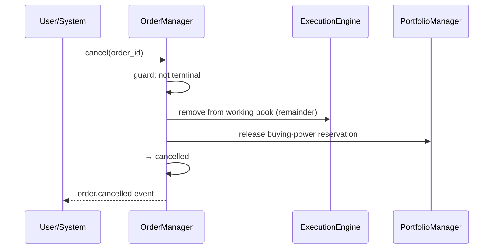
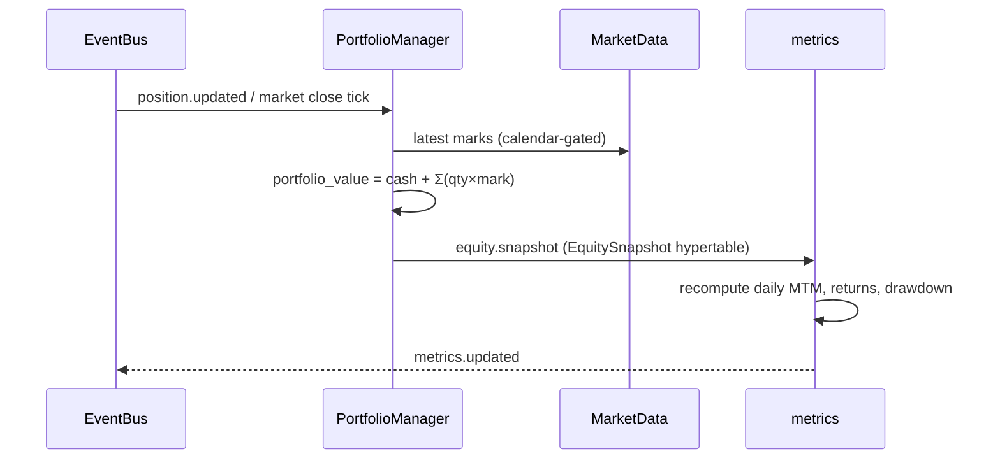

# OMS / Paper Trading Core — Technical Design Document

**Status:** APPROVED (ADR 0006) · **Phase:** Design-only (no implementation) · **Design date:** 2026-07-24 · **Approved:** 2026-08-02
**Author:** Claude (design) · **Approved by:** user (2026-08-02) with 5 locked decisions + cross-cutting mandates (§17)
**Depends on:** PostgreSQL/TimescaleDB validation passing (see `docs/validation/`) — the sole remaining gate before implementation.

> **Scope guard.** This document specifies architecture and contracts only. No implementation code,
> migrations, API handlers, or frontend components are produced in this phase. This design is now
> **approved**; implementation begins **only after** the PG/TimescaleDB validation passes (the second gate
> is satisfied). See §17 for the approved decisions and mandates that bind implementation.

---

## 0. Reconciliation with what already exists

The `trading`, `risk`, and `metrics` domains already ship stub models. This design **refines** them; it does
not start from a blank slate. Every proposed change below is called out as `[EXISTS]`, `[REFINE]`, or `[NEW]`
so the review can see the delta.

| Existing model | File | Disposition |
|---|---|---|
| `Portfolio` | `trading/models.py` | `[REFINE]` add derived-accounting columns / view |
| `Order` | `trading/models.py` | `[REFINE]` extend status enum, add lifecycle + idempotency fields |
| `OrderDecision` | `trading/models.py` | `[EXISTS]` unchanged (explainability, one-to-one) |
| `Fill` | `trading/models.py` | `[REFINE]` add `sebi_charges`, `stamp_duty` already present, fill sequence, liquidity fields |
| `Position` | `trading/models.py` | `[REFINE]` keep as aggregate; add `PositionLot` for FIFO |
| `Transaction` | `trading/models.py` | `[EXISTS]` append-only cash ledger, reused as-is |
| `RiskLimit`/`RiskEvent`/`KillSwitch` | `risk/models.py` | `[EXISTS]` OMS is a **client** of these, never a modifier |
| `EquitySnapshot`/`PerformanceMetric` | `metrics/models.py` | `[EXISTS]` OMS emits events; metrics consumes them |
| `OrderEvent` (event store) | — | `[NEW]` append-only domain-event log |
| `PositionLot` (FIFO lots) | — | `[NEW]` per-lot cost basis |
| `OmsOutbox` (transactional outbox) | — | `[NEW]` reliable event publication |

**Non-negotiable inherited rule** (from architecture decisions): the Risk Engine is a **mandatory pre-trade
gate** in the order path, not advisory. The OMS must never open a code path that reaches execution without a
`passed` risk verdict. This design encodes that as a state-machine invariant, not a convention.

---

## 1. High-Level Architecture

### 1.1 Domain boundaries

The OMS is the `trading` domain of the modular monolith. It owns the **money path**: turning an approved
intent into fills, positions, cash movements, and P&L. It is deliberately bounded so it can later be
extracted into its own service without rewrites.

```
                 ┌──────────────────────────────────────────────────────────┐
                 │                     trading (OMS)                          │
   Strategy      │  ┌────────────┐   ┌──────────────┐   ┌─────────────────┐   │
   signal ─────▶ │  │  Order     │──▶│  Execution   │──▶│  Fill Engine    │   │
   (+Decision)   │  │  Manager   │   │  Engine      │   │  (sim matching) │   │
                 │  └─────┬──────┘   └──────┬───────┘   └────────┬────────┘   │
                 │        │                 │                    │            │
   Risk Engine ◀─┼── pre-trade gate         │                    ▼            │
   (mandatory)   │        │          ┌───────▼────────┐   ┌──────────────┐    │
                 │        │          │ Position Mgr   │◀──│ Cost Engine  │    │
                 │        │          │ (FIFO lots)    │   │ (Indian)     │    │
                 │        │          └───────┬────────┘   └──────────────┘    │
                 │        │                  │                                │
                 │  ┌─────▼──────┐   ┌────────▼───────┐   ┌──────────────┐    │
                 │  │ Portfolio  │◀──│  Cash Ledger   │   │  P&L Engine  │    │
                 │  │ Manager    │   │ (Transaction)  │   │              │    │
                 │  └─────┬──────┘   └────────────────┘   └──────────────┘    │
                 │        │                                                   │
                 │        └────────────▶  Event Bus (outbox → dispatch) ──────┼──▶ metrics,
                 └──────────────────────────────────────────────────────────┘     research, UI
```

### 1.2 Module responsibilities

| Module | Owns | Does **not** own |
|---|---|---|
| **Order Manager** | Order intake, validation, lifecycle state, idempotency, cancel/replace | Matching, cash math |
| **Execution Engine** | Working-order book, trigger evaluation (stop/trailing), routing to Fill Engine | Risk decisions |
| **Fill Engine** | Simulated matching: partials, slippage, latency, liquidity, price improvement | Cost computation |
| **Cost Engine** | Indian charges (brokerage/STT/GST/stamp/exchange/SEBI/DP) | Fill price |
| **Position Manager** | FIFO lots, average price, realized/unrealized quantity, exposure | Cash |
| **Cash Ledger** | Immutable signed cash movements + running balance | Position math |
| **Portfolio Manager** | Buying power, invested capital, portfolio valuation, allocation | Order state |
| **P&L Engine** | Realized/unrealized P&L, daily MTM, returns | Persistence of metrics (metrics domain does) |
| **Event Bus Integration** | Outbox write + reliable dispatch of domain events | Consumer logic |

### 1.3 Interaction with the existing Market Data Layer

The OMS is a **read-only consumer** of `market_data`. It never writes prices.

- **Fill pricing** reads the reference price for the instrument/timeframe from the Market Data service
  (last close / current bar), applies the Fill Engine simulation, and never fabricates a price the data layer
  did not provide.
- **Mark-to-market** for unrealized P&L and equity snapshots reads the latest available bar through the same
  service, honoring the layer's UTC-storage / exchange-local-interpretation contract (`sessions.exchange_timezone`).
- **Trading-calendar awareness**: order acceptance, expiry (`DAY` TIF), and MTM cadence ask the Market
  Calendar whether the exchange traded — the OMS contains **no date logic of its own**, matching the schedulers
  rule already established for market data.
- **Corporate actions**: because market-data Close is already split/bonus adjusted (ADR 0005), open paper
  positions must be adjusted on ex-date by a dedicated **Corporate Action Applier** so a 1:2 split doubles
  quantity and halves average price without generating phantom P&L. This is called out explicitly as a
  correctness hazard in §14.

### 1.4 Future compatibility

The OMS is designed so the following attach without restructuring:

| Future subsystem | Attachment point | Design accommodation |
|---|---|---|
| **Backtesting** | Fill Engine + Cost Engine are pure, injectable strategies | Same matching/cost code runs in backtest and paper; only the clock and data source differ (`ExecutionClock` abstraction) |
| **Risk Engine** | Pre-trade gate interface (`RiskGate.evaluate(order_intent) -> Verdict`) | Already mandatory; OMS calls it, never inlines rules |
| **AI Research Engine** | Consumes the event stream + `OrderDecision` explainability | Read-only; no OMS change needed |
| **Live Broker Integration** | `ExecutionVenue` interface (paper venue is one implementation) | Fill Engine sits behind the same interface a real broker adapter will implement; `TradingMode.live` already reserved and gated |

**Broker independence (locked decision, ADR 0016).** The OMS, Portfolio, Risk Engine, and Backtesting Engine
**must never depend on broker-specific implementations.** All execution flows through the **broker/execution
abstraction** (`ExecutionVenue`): a single execution contract with `submit / cancel / replace` and a fill
callback stream. Paper execution and future live execution are two implementations of that **same contract** —
so nothing above the venue boundary knows or cares whether fills came from the paper simulator or a real broker.
Broker-specific concerns (auth, order-type mapping, rate limits, reconciliation quirks) live entirely inside a
broker adapter behind the interface. This is what makes paper→live a driver swap, not a rewrite, and keeps the
core provably broker-agnostic (enforced by module boundaries + a contract test both implementations must pass).

---

## 2. OMS Components (detailed responsibilities & interfaces)

Interfaces below are **contract sketches** (Python-typed signatures for clarity), not implementations.

### 2.1 Order Management
```
class OrderManager:
    def submit(intent: OrderIntent) -> Order            # idempotent on client_order_id
    def cancel(order_id, reason) -> Order
    def replace(order_id, changes: OrderAmendment) -> Order   # cancel/replace semantics (future)
    def get(order_id) -> OrderView
```
Owns the state machine (§3), idempotency, and emits `order.*` events. Persists nothing about cash or positions.

### 2.2 Execution Engine
```
class ExecutionEngine:
    def admit(order: Order) -> None          # place on working book if not immediately marketable
    def on_market_tick(instrument_id, bar) -> list[TriggerEvent]   # evaluate stops/limits/trailing
    def route(order: Order) -> FillRequest    # hand a marketable order to the Fill Engine
```
Holds the **working-order book** (in-memory, rebuildable from the event store — see §14). Evaluates triggers
against market data. Never decides risk or cost.

### 2.3 Portfolio Manager
```
class PortfolioManager:
    def buying_power(portfolio_id) -> Money
    def valuation(portfolio_id, as_of) -> PortfolioValuation
    def allocation(portfolio_id) -> AllocationBreakdown
```
Derives account-level figures from Cash Ledger + Position Manager + Market Data. Computes **available buying
power** used by the Risk Engine's buying-power check.

### 2.4 Position Manager
```
class PositionManager:
    def apply_fill(fill: Fill) -> PositionDelta     # updates FIFO lots + aggregate
    def realized_pnl(position_id, window) -> Money
    def exposure(portfolio_id) -> dict[instrument_id, Money]
```
Maintains `Position` (aggregate) + `PositionLot` (FIFO cost basis). Long now; short-ready (§8).

### 2.5 Cash Ledger
**APPROVED: full append-only double-entry ledger (Decision 1).** Every economic event — order, fee, tax,
dividend, corporate action, adjustment — posts a **balanced set of ledger entries** (debits = credits) against
named accounts (e.g. `cash`, `settlement_payable`, `brokerage_expense`, `stt_expense`, `gst_expense`,
`realized_pnl`). One `fee`/`tax` entry **per charge class** — never netted, so every charge is independently
auditable. **No updates, no deletes, no in-place edits.** Every balance is *derived* by summing immutable
entries; a cached balance projection exists **only for performance** and is always reconcilable to (and
rebuildable from) the ledger. Every entry is timestamped, carries the correlation/causation metadata of §11,
and is keyed for idempotency (§11.3).

### 2.6 P&L Engine
Pure functions over lots + marks (§9). Stateless; results are persisted by the metrics domain, not here.

### 2.7 Cost Engine
Pure, configurable Indian cost model (§6). Same code path in paper and backtest.

### 2.8 Event Bus Integration
Transactional outbox (§11): domain events are written **in the same DB transaction** as the state change, then
dispatched by a relay to in-process consumers (metrics, analytics) and, later, cross-service consumers.

---

## 3. Complete Order Lifecycle

### 3.1 States

`[REFINE]` The existing `OrderStatus` enum (`pending/filled/partial/cancelled/rejected`) is extended to the full
requested lifecycle:

| State | Meaning | Terminal? |
|---|---|---|
| `created` | Intent persisted, not yet validated | no |
| `validated` | Passed structural/business validation (instrument tradable, qty>0, price sane) | no |
| `accepted` | Passed the **Risk pre-trade gate**; admitted to the OMS | no |
| `pending` | Working on the book, awaiting trigger/liquidity (a.k.a. "working/open") | no |
| `partially_filled` | Some quantity filled, remainder still working | no |
| `filled` | Fully filled | **yes** |
| `cancelled` | Cancelled by user/system before full fill | **yes** |
| `rejected` | Rejected by validation **or** risk gate | **yes** |
| `expired` | TIF (e.g. `DAY`) elapsed before full fill | **yes** |

> Naming note: existing enum value `partial` → renamed `partially_filled`; `pending` retained. Migration will
> map old values. (Migration is **not** written in this phase.)

### 3.2 State diagram



### 3.3 Transition rules (allowed actions per state)

| From | Allowed action | Guard | To |
|---|---|---|---|
| `created` | `validate` | structural + instrument tradable | `validated` / `rejected` |
| `validated` | `risk_check` | **Risk gate verdict** (mandatory) | `accepted` / `rejected` |
| `accepted` | `admit` | marketable? | `pending` / `partially_filled` / `filled` |
| `pending` | `fill` | liquidity + trigger conditions | `partially_filled` / `filled` |
| `pending` | `cancel` | not terminal | `cancelled` |
| `pending` | `expire` | TIF elapsed & calendar day closed | `expired` |
| `partially_filled` | `fill`/`cancel`/`expire` | as above (applies to remainder) | `partially_filled`/`filled`/`cancelled`/`expired` |
| any terminal | — | none | — (immutable) |

**Invariants (enforced, not assumed):**
1. **No fill without `accepted`.** A fill event is only legal if the order has passed through `accepted`,
   which is only reachable via a `passed` Risk verdict. This is the encoding of the non-negotiable rule.
2. **Terminal states are immutable.** No transition leaves `filled/cancelled/rejected/expired`.
3. **Conservation:** `filled_quantity + open_quantity == order.quantity` at all times;
   `open_quantity == 0 ⇔ filled`.
4. Every transition writes exactly one append-only `OrderEvent` (§11/§12) in the same transaction.

---

## 4. Order Types

### 4.1 Supported at launch

| Type | Trigger | Fill reference | Notes |
|---|---|---|---|
| **Market** | immediate | reference price ± slippage | never rests on book |
| **Limit** | price crosses limit | fills at limit or better (price improvement) | rests until marketable/expiry |
| **Stop Market** | last price crosses `stop_price` | becomes market on trigger | trigger direction depends on side |
| **Stop Limit** | last crosses `stop_price` | becomes limit at `limit_price` | may rest after trigger |
| **Trailing Stop** `[NEW]` | dynamic stop trails by `trail_amount`/`trail_pct` | becomes market on trigger | requires stored `high_water_mark`/`low_water_mark` |

`[REFINE]` Order model gains: `time_in_force` (`DAY`/`GTC`/`IOC`/`FOK`), `trail_amount`, `trail_pct`,
`trail_reference` (high/low water mark), `filled_quantity`, `avg_fill_price`, `client_order_id`.

### 4.2 Designed-for (future, not built)

Modeled as **parent/child order groups** so the schema does not need reshaping later:

| Type | Composition | Schema hook |
|---|---|---|
| **Bracket** | entry + linked take-profit + stop-loss | `parent_order_id` + `order_group_id` + `group_role` |
| **OCO** (one-cancels-other) | two siblings; fill/cancel of one cancels the other | `order_group_id` + `oco_group` semantics |
| **Iceberg** | large order sliced into visible clips | `display_quantity` + `total_quantity` |
| **Basket** | N orders submitted/managed atomically | `basket_id` grouping |

`[NEW]` `OrderGroup` table introduced now (empty of behavior) so bracket/OCO attach without a migration that
touches live orders. Launch order types set `order_group_id = NULL`.

---

## 5. Fill Engine

The Fill Engine is the paper-trading heart and the single most important correctness surface after the
backtester. It is a pure simulator behind the `ExecutionVenue` interface.

### 5.1 Partial & multiple fills
- An order may receive **N fill events**; each is an immutable `Fill` row with a `fill_seq` within the order.
- Fill quantity is capped by simulated **available liquidity** for the bar (§5.6).
- Remainder stays working (`partially_filled`) until filled, cancelled, or expired.

### 5.2 Price improvement
- **Limit buy** at ₹100 when reference is ₹99.50 fills at **₹99.50** (better), not ₹100.
- Improvement is bounded by the bar's low/high so simulation never fills outside the bar's real range.

### 5.3 Slippage simulation
Configurable models, selected per portfolio / backtest params (`params.slippage`):
| Model | Formula sketch |
|---|---|
| `fixed_bps` | `price × (1 ± bps/10_000)` |
| `spread_fraction` | `price ± f × half_spread` |
| `volume_participation` | slippage grows with `order_qty / bar_volume` (market impact) |
Slippage is stored per fill (`Fill.slippage`, already present) so realized cost is auditable.

### 5.4 Exchange latency simulation
- An `ExecutionClock` introduces a configurable **decision→fill delay**; a market order submitted at bar close
  may fill against the **next** bar's open (configurable), preventing look-ahead. This is shared with the
  backtester to keep paper and backtest fills consistent.

### 5.5 Liquidity constraints
- Max fillable quantity per bar = `min(order_open_qty, participation_cap × bar_volume)`.
- Illiquid instruments (thin/zero volume — a real Yahoo finding) either **do not fill** that bar or fill a
  reduced clip; never fill infinite size at one price.

### 5.6 Determinism
Given identical inputs (order, bar, config, seed), the Fill Engine is **deterministic**. Any randomness
(e.g. stochastic slippage) is seeded per `(order_id, fill_seq)` so paper runs are reproducible and testable —
essential for the "test the money path hardest" mandate.

---

## 6. Indian Cost Model

`[REFINE]` `Fill` already carries `brokerage, stt, exchange_charges, gst, stamp_duty, slippage`. Add
`sebi_charges` `[NEW]` and reserve `dp_charges` `[NEW]` (future, delivery/demat).

### 6.1 Charge catalogue (equity delivery & intraday; configurable)

| Charge | Basis (typical, configurable) | Buy | Sell | Notes |
|---|---|---|---|---|
| **Brokerage** | flat or % (e.g. ₹0 delivery / ₹20 or 0.03% intraday, capped) | ✓ | ✓ | per-broker profile |
| **STT** | % of turnover (delivery ~0.1% both sides; intraday sell side) | ✓/✗ | ✓ | side-dependent |
| **Exchange txn charges** | % of turnover, **NSE vs BSE differ** | ✓ | ✓ | exchange-specific rate |
| **GST** | 18% of (brokerage + exchange txn + SEBI) | ✓ | ✓ | tax on charges, not turnover |
| **Stamp duty** | % of turnover, **buy side only** | ✓ | ✗ | state/− regulated |
| **SEBI charges** `[NEW]` | per-crore of turnover | ✓ | ✓ | tiny but real |
| **DP charges** `[NEW]` | flat per sell scrip (demat) | ✗ | ✓ (future) | delivery only |

### 6.2 Design rules
- **Every charge is a pluggable `ChargeComponent`** with `applies(fill_context) -> bool` and
  `compute(fill_context) -> Money`. The cost of a fill is the ordered sum of active components.
- **Configuration is versioned** (`CostProfile` with `effective_from`) so historical fills reprice with the
  rates that were in force — required for correct backtests across rate changes.
- **Rounding** follows exchange convention (round to paise) and is applied per-component, then summed, to match
  real contract notes; total stored alongside components.
- GST depends on other components, so components have a declared **evaluation order** (turnover-based first,
  then GST on the taxable subset).
- Paper and backtest use the **same `CostProfile`**; divergence here silently invalidates backtests, so it is
  a single source of truth.

---

## 7. Portfolio Accounting

All money is `NUMERIC` (never float). Derived figures are computed, not stored redundantly (except cached
snapshots for the equity curve).

| Figure | Definition |
|---|---|
| **Cash Balance** | `Transaction.balance_after` latest (authoritative, from ledger) |
| **Available Buying Power** | `cash_balance − reserved_for_working_buy_orders − pending_charges` |
| **Invested Capital** | Σ over open lots of `lot_qty × lot_cost_basis` |
| **Position Value** | Σ over open positions of `qty × current_mark` (market-data mark) |
| **Portfolio Value (equity)** | `cash_balance + position_value` |
| **Exposure** | `position_value / portfolio_value` (gross & net when shorts exist) |
| **Allocation** | per-instrument `position_value / portfolio_value` |
| **Asset Allocation** | per-sector / asset-class aggregation of allocation |

**Buying-power reservation.** When a buy order is `accepted`/`pending`, its worst-case cash (limit price ×
qty + estimated charges) is **reserved** so two concurrent orders can't both spend the same rupee. Reservation
is released on fill (replaced by actual debit), cancel, or expiry. This is what the Risk Engine's buying-power
check reads.

---

## 8. Position Management

### 8.1 Model
- `[EXISTS]` `Position` stays the **aggregate** per (portfolio, instrument): net qty, avg entry, realized &
  unrealized P&L, status.
- `[NEW]` `PositionLot`: one row per acquisition lot — `qty_opened`, `qty_remaining`, `cost_basis`,
  `opened_at`, `source_fill_id`. **FIFO** consumption on sells.

### 8.2 Long / Short
- **Long** at launch. **Short-ready**: `Position.quantity` is signed; lots carry a `direction`; the P&L and
  exposure math is written to handle negative quantity from day one, but short *entry* is gated off until Risk
  Engine short rules exist. No schema change needed to enable shorts later.

### 8.3 Accounting quantities
| Field | Meaning |
|---|---|
| **Average Price** | `Σ(lot_qty_remaining × cost_basis) / Σ lot_qty_remaining` over open lots |
| **Quantity** | signed net position |
| **Realized Quantity** | cumulative quantity closed (for turnover/P&L attribution) |
| **Unrealized Quantity** | currently open quantity (= `Σ lot_qty_remaining`) |
| **Exposure** | `abs(quantity) × current_mark` |

### 8.4 FIFO on a sell (worked example)
Buy 100 @ ₹100 (lot A), buy 50 @ ₹110 (lot B). Sell 120:
- Consume 100 from A → realized P&L on 100 @ (sell − 100).
- Consume 20 from B → realized P&L on 20 @ (sell − 110).
- Remaining: lot B with 30 @ ₹110. Avg price = ₹110.
Realized P&L is **net of the allocated share of entry+exit charges** (§6), not gross price difference.

---

## 9. P&L Engine

| Metric | Definition |
|---|---|
| **Realized P&L** | Σ over closed lot-fractions of `(exit_price − entry_cost_basis) × qty − allocated_charges` |
| **Unrealized P&L** | Σ over open lots of `(current_mark − cost_basis) × qty_remaining` |
| **Daily MTM** | `equity(today_close) − equity(prev_close) + net_external_cashflow` |
| **Total Return** | `(equity_now − initial_capital) / initial_capital` (time-weighted variant available) |
| **CAGR** | `(equity_now / initial_capital) ^ (365 / days) − 1` |
| **XIRR** (future) | cash-flow-weighted IRR over dated deposits/withdrawals + terminal equity |
| **Portfolio Performance** | delegated to `metrics` domain (Sharpe/Sortino/DD/profit-factor/expectancy) |

**Boundaries.** The P&L Engine **computes**; the `metrics` domain **persists** (`EquitySnapshot` hypertable,
`PerformanceMetric`). The OMS emits `position.updated`/`portfolio.updated`/`equity.snapshot` events; metrics
consumes them. This keeps the money path and the analytics path decoupled and independently testable.

**MTM cadence.** Daily MTM runs on exchange close (calendar-gated). Intraday snapshots optional and
event-driven. `EquitySnapshot` is the existing hypertable; the OMS is a producer.

---

## 10. Risk Integration

### 10.1 The gate (mandatory, non-bypassable)
```
class RiskGate(Protocol):
    def evaluate(intent: OrderIntent, portfolio_state: PortfolioSnapshot) -> RiskVerdict
# RiskVerdict = PASSED | BLOCKED(rule, detail)  — one RiskEvent row per rule checked
```
The Order Manager calls `RiskGate.evaluate` on **every** order between `validated` and `accepted`. There is no
other route to `accepted`, and no route from `validated`/`accepted` to a fill that skips it. The gate is an
injected dependency (real engine in prod, permissive stub only in isolated unit tests that never touch the
execution path).

### 10.2 Required checks (each an auditable `RiskEvent`)
Mapped to the existing `RiskLimit` fields where present:

| Check | Backing limit (`risk/models.py`) |
|---|---|
| Position Size Validation | `per_trade_risk_pct`, `max_position_correlation`… |
| Buying Power Validation | Portfolio Manager available buying power (§7) |
| Daily Loss Validation | `max_daily_loss_pct` |
| Drawdown Validation | `max_drawdown_pct` |
| Portfolio Exposure Validation | `max_portfolio_heat_pct`, `max_sector_exposure_pct`, `max_open_positions` |
| Correlation Validation | `max_position_correlation` |
| Kill Switch Validation | `KillSwitch.is_active` (hard block, first check) |

### 10.3 Rules
- **Kill switch is evaluated first**; if active, the order is `rejected` before any other work.
- A `BLOCKED` verdict transitions the order to `rejected`, writes `Order.rejected_reason`, and emits
  `order.rejected` — it **never** silently drops.
- The OMS treats the Risk Engine as authoritative and **owns no risk logic**. Risk owns limits; OMS owns
  execution. This boundary is what lets Risk evolve independently.

---

## 11. Event Architecture

### 11.1 Event taxonomy
```
signal.generated            (upstream: strategies)
  → order.created
  → order.validated | order.rejected
  → risk.checked (passed|blocked)
  → order.accepted | order.rejected
  → order.partially_filled | order.filled
      → fill.recorded
      → position.updated
      → cash.transaction.recorded
      → portfolio.updated
      → equity.snapshot            (metrics)
      → metrics.updated            (metrics)
      → analytics.updated          (research/analytics)
  → order.cancelled | order.expired
```

### 11.2 Delivery: transactional outbox
`[NEW]` To guarantee "state change ⇒ event, exactly once to consumers":
1. The state change and an `OmsOutbox` row are written in **one DB transaction**.
2. A relay (Celery beat / listener) reads unpublished outbox rows and dispatches to consumers, marking them
   published. Redis is the fast dispatch bus; the DB outbox is the source of truth.
3. If Redis is down, events queue in the outbox and drain on recovery — no event loss (see §14).

### 11.2a Event metadata (APPROVED — mandatory on every event)
Every event (and every `order_events` / `oms_outbox` row) carries: **`event_id`**, **`aggregate_id`**,
**`event_version`** (per-aggregate monotonic sequence), **`timestamp`** (Clock-sourced UTC, §17), **`correlation_id`**
(ties one logical flow: signal → order → fills → postings), and **`causation_id`** (the event that directly
caused this one). This is the substrate for event replay (§17) and cross-aggregate audit.

### 11.2b Full event-sourced replay (APPROVED)
The **complete OMS state** — orders, positions, lots, cash ledger, portfolio — must be reconstructable
**entirely from the append-only event log** (`order_events` + ledger entries + outbox). No business state may
become unrecoverable. Projections (working order book, position aggregates, cached balances) are derived views,
always rebuildable by replaying events through the same deterministic handlers used online.

### 11.3 Idempotency
- Every order submission carries a client **idempotency key** (`client_order_id`); repeated requests **never**
  create duplicate orders (duplicate submit returns the existing order).
- Every event has a stable `event_id` (UUID) and a `dedup_key`.
- **Consumers must be idempotent.** A fill applied twice must not double a position. Enforced by:
  - `Fill` uniqueness on `(order_id, fill_seq)`;
  - Position updates keyed by `fill_id` (applying the same fill is a no-op);
  - Cash `Transaction` keyed by `related_order_id + fill_seq + charge_class`.
- Order **submission** is idempotent on `client_order_id` (duplicate submit returns the existing order).

---

## 12. Database Design

> Design only. **No migrations are written in this phase.** Column types follow existing conventions:
> `UUID` PKs, `NUMERIC` money, DB-native enums, `TIMESTAMPTZ` in UTC, append-only where noted.

### 12.1 Tables (delta view)

**`orders`** `[REFINE]` — add:
`client_order_id (unique per portfolio)`, `time_in_force`, `filled_quantity`, `avg_fill_price`,
`trail_amount`, `trail_pct`, `trail_reference`, `order_group_id (nullable)`, `group_role (nullable)`,
`expires_at (nullable)`; extend `status` enum (§3.1); `order_type` enum gains `trailing_stop`.

**`order_events`** `[NEW]` — append-only lifecycle log:
`id, order_id (FK), seq (int), event_type, from_status, to_status, payload (JSON), created_at`.
Unique `(order_id, seq)`. This is the OMS audit trail and the rebuild source for the working book.

**`fills`** `[REFINE]` — add `fill_seq (int)`, `sebi_charges`, `total_charges`, `liquidity_flag`,
`is_price_improved`. Unique `(order_id, fill_seq)`. Append-only.

**`position_lots`** `[NEW]` — `id, position_id (FK), direction, qty_opened, qty_remaining, cost_basis,
source_fill_id (FK), opened_at, closed_at (nullable)`. FIFO consumed oldest-first.

**`order_groups`** `[NEW]` — `id, portfolio_id (FK), group_type (bracket|oco|basket|iceberg), created_at`.
Reserved for future; launch orders reference `NULL`.

**`cost_profiles`** `[NEW]` — versioned charge config: `id, name, exchange, segment, effective_from,
config (JSON), is_active`.

**`oms_outbox`** `[NEW]` — `id, aggregate_type, aggregate_id, event_type, event_version, correlation_id,
causation_id, payload (JSON), created_at, published_at (nullable)`. Index on `published_at IS NULL`.
`order_events` carries the same metadata columns (§11.2a).

**`ledger_entries`** `[NEW — supersedes single-entry `transactions`]` — double-entry (Decision 1):
`id, portfolio_id (FK), posting_id (groups the balanced set), account, direction (debit|credit), amount (NUMERIC),
event_type (trade|brokerage|stt|gst|stamp_duty|exchange|sebi|dp|dividend|corp_action|adjustment),
related_order_id (nullable), related_fill_id (nullable), correlation_id, causation_id, created_at`.
Invariant: `SUM(debit) = SUM(credit)` per `posting_id`. Append-only; **no update/delete**. Dedup key per §11.3.
The existing `transactions` table is either migrated into this shape or retired; a cached `cash_balances`
projection is a rebuildable convenience, not a source of truth.

**`portfolios` / `positions`** — largely `[EXISTS]`; `positions` becomes an aggregate over `position_lots`,
rebuildable from the event log (§11.2b).

**`equity_snapshots` / `performance_metrics`** — `[EXISTS]` in `metrics`; OMS is a producer only.

### 12.2 Relationships
```
portfolios 1─* orders 1─* order_events
orders 1─* fills *─1 position_lots (source_fill)
portfolios 1─* positions 1─* position_lots
portfolios 1─* transactions
orders *─1 order_groups (nullable)
portfolios 1─1 risk_limits / kill_switches   (risk domain)
portfolios 1─* equity_snapshots               (metrics domain, hypertable)
```

### 12.3 Indexes
- `orders (portfolio_id, status)`, `orders (portfolio_id, client_order_id) UNIQUE`, `orders (expires_at) WHERE status IN (pending, partially_filled)`.
- `order_events (order_id, seq) UNIQUE`.
- `fills (order_id, fill_seq) UNIQUE`, `fills (executed_at)`.
- `position_lots (position_id, opened_at)` (FIFO scan), partial index `WHERE qty_remaining > 0`.
- `oms_outbox (published_at) WHERE published_at IS NULL`.
- `transactions (portfolio_id, created_at)`.

### 12.4 Constraints
- `CHECK (quantity > 0)`, `CHECK (filled_quantity <= quantity)`, `CHECK (filled_quantity >= 0)`.
- `CHECK (qty_remaining >= 0 AND qty_remaining <= qty_opened)`.
- FK enforcement everywhere; enums DB-native.
- Terminal-state immutability enforced at the service layer + optionally a trigger (design choice flagged for
  review): once `status` is terminal, updates are rejected.

### 12.5 Append-only / audit strategy
`order_events`, `fills`, `transactions`, `risk_events`, `audit_log` are **insert-only**. State on `orders`/
`positions` is a materialized projection of these logs and is always reconstructible by replaying
`order_events` + `fills` — this is the recovery backbone (§14).

### 12.6 Event storage
Domain events live in `order_events` (per-order truth) and `oms_outbox` (delivery). High-volume analytics
events are **not** stored in Postgres long-term; they flow through Redis to consumers and, if retention is
needed, land in a metrics table — keeping the OLTP tables lean.

---

## 13. API Design

> Documented, **not implemented** this phase. REST + WebSocket, JWT/RBAC via existing `platform` auth.

### 13.1 REST (sketch)
| Method | Path | Purpose |
|---|---|---|
| `POST` | `/api/v1/portfolios/{id}/orders` | Submit order (idempotent on `client_order_id`) → returns `Order` |
| `GET` | `/api/v1/orders/{id}` | Order + lifecycle events |
| `DELETE` | `/api/v1/orders/{id}` | Cancel |
| `PATCH` | `/api/v1/orders/{id}` | Replace/amend (future) |
| `GET` | `/api/v1/portfolios/{id}` | Valuation, buying power, allocation |
| `GET` | `/api/v1/portfolios/{id}/positions` | Positions + lots |
| `GET` | `/api/v1/portfolios/{id}/fills` | Fill history (contract-note detail) |
| `GET` | `/api/v1/portfolios/{id}/transactions` | Cash ledger |
| `GET` | `/api/v1/portfolios/{id}/pnl` | Realized/unrealized/MTM |

**Submit payload** carries `client_order_id`, `instrument_id`, `side`, `order_type`, `quantity`,
`limit_price?`, `stop_price?`, `trail_*?`, `time_in_force`, and an optional `OrderDecision` block
(explainability). Response codes: `201` accepted, `202` accepted-working, `409` duplicate client_order_id,
`422` validation, `403` risk-blocked/kill-switch (with `RiskEvent` detail).

### 13.2 WebSocket events (server→client)
`order.status_changed`, `fill.recorded`, `position.updated`, `portfolio.updated`, `equity.snapshot`,
`risk.blocked`, `kill_switch.activated`. Payloads mirror §11 domain events; the socket is a read projection of
the outbox stream, scoped by portfolio + RBAC.

---

## 14. Failure & Recovery

| Failure | Handling |
|---|---|
| **Duplicate orders** | `client_order_id` uniqueness → duplicate submit returns the existing order (`409`/idempotent). Network retries are safe. |
| **Partial fills** | First-class state (§3). Remainder keeps working; crash-safe because fills are append-only with `fill_seq`. |
| **Network failures (client)** | Idempotent submit + `GET /orders/{id}` reconciliation; client can safely re-submit with same `client_order_id`. |
| **Provider (market data) failures** | Fill/MTM needs a mark; if unavailable, orders stay `pending` (do not fill on stale/absent data), MTM skips the cycle and flags staleness. No fabricated prices. |
| **Database failures** | All money-path writes are single transactions (order state + event + outbox atomic). A failed commit leaves no partial state; the order simply isn't advanced. |
| **Worker crashes** | Working-order book is **in-memory but rebuildable**: on restart, replay `order_events` + open `orders` to reconstruct the book. No state lives only in memory. |
| **Redis failures** | Outbox is the source of truth. Dispatch pauses; on Redis recovery the relay drains unpublished outbox rows. Consumers idempotent → safe replay. Matches the market-data "degrade without Redis" posture. |
| **Corporate action on open position** | Ex-date applier adjusts qty/avg-price for splits/bonuses (ADR 0005 hazard) atomically with an `order_event`/`transaction` audit entry; no phantom P&L. |
| **Double-dispatch** | Consumer idempotency (§11.3): re-applying a fill/transaction is a no-op via unique keys. |
| **Kill switch mid-flight** | Working orders can be cancelled en masse; no *new* order passes the gate while active. |

**Recovery procedure (summary):** (1) restore DB (authoritative), (2) rebuild working book from
`order_events`, (3) drain `oms_outbox`, (4) reconcile positions/cash by replaying append-only logs, (5) resume
calendar-gated MTM. Because projections derive from insert-only logs, recovery is deterministic.

---

## 15. Sequence Diagrams

### 15.1 Market order (happy path)


### 15.2 Limit order (rests, then fills)


### 15.3 Partial fill


### 15.4 Order cancellation


### 15.5 Position update (on fill)
```mermaid
sequenceDiagram
    participant EX as ExecutionEngine
    participant PM as PositionManager
    participant CL as CashLedger
    participant EB as EventBus
    EX->>PM: apply_fill(fill)
    PM->>PM: buy → new lot; sell → FIFO consume lots + realized P&L
    PM->>PM: recompute avg price, qty, exposure
    PM->>CL: (net) cash movement + per-charge entries
    PM->>EB: position.updated
```

### 15.6 Portfolio update / equity snapshot


---

## 16. Design Review

### 16.1 Architectural trade-offs
- **In-memory working book vs. DB-only book.** Chosen: in-memory for latency, **rebuildable from
  `order_events`**. Trade-off: reconstruction logic complexity, bought back by speed and by an audit log we
  need anyway.
- **Transactional outbox vs. direct Redis publish.** Chosen: outbox. Trade-off: an extra table + relay, in
  exchange for exactly-the-money-path-changed-⇒-event-emitted with zero loss when Redis is down.
- **FIFO lots as separate rows vs. single aggregate.** Chosen: lots. Trade-off: more rows and joins, bought
  back by correct realized-P&L attribution, tax-lot readiness, and audit precision. Aggregate `Position` kept
  as a fast projection.
- **Per-charge cash entries vs. single netted cost entry.** Leaning: single netted cost `Transaction` +
  per-charge breakdown on the `Fill` (contract-note style), to keep the ledger readable while preserving
  detail. **Flagged for reviewer decision.**
- **Shared Fill/Cost Engine for paper and backtest.** Chosen: one implementation behind `ExecutionVenue`.
  Trade-off: the abstraction must satisfy both the live-ish paper clock and the batch backtest clock; worth it
  because divergence between paper and backtest costs is a silent correctness killer.

### 16.2 Alternatives considered
- **Event-sourcing the entire OMS** (state derived purely from an event stream, no mutable `orders` row).
  Rejected for now: heavier to build and reason about; we get most of the benefit (auditability, rebuild) via
  append-only `order_events` + projections, without full ES machinery. Migration path to full ES stays open.
- **Microservice OMS** from day one. Rejected per the locked modular-monolith decision; boundaries here are
  drawn so extraction later is mechanical.
- **Storing derived portfolio figures** (buying power, exposure) as columns. Rejected: derive on read to avoid
  drift; cache only the equity curve (already a hypertable).
- **Broker-style price-time priority matching engine.** Overkill for single-participant paper trading; the
  Fill Engine models liquidity/slippage/latency statistically instead, which is what a backtest needs.

### 16.3 Why this design was selected
It satisfies the three project imperatives: (1) **correctness of the money path** via append-only logs, FIFO
lots, `NUMERIC` money, deterministic seeded fills, and consumer idempotency; (2) the **non-negotiable Risk
gate** as a state-machine invariant, not a convention; (3) **reuse** — it refines existing `trading`/`risk`/
`metrics` stubs rather than replacing them, and shares its Fill/Cost engines with the backtester so the crown-
jewel backtest and paper trading can never silently disagree on execution or cost.

### 16.4 Scalability analysis
- **Write volume** is modest (paper trading, one/few users). The append-only tables (`order_events`, `fills`,
  `transactions`) grow linearly with activity; standard Postgres handles this comfortably. `equity_snapshots`
  is already a hypertable for time-series scale.
- **Read scaling**: portfolio/positions endpoints are per-portfolio and index-served; derived figures computed
  on demand, cached briefly in Redis where hot.
- **Hot path**: the working book is O(open orders); trigger evaluation is O(open orders per instrument per
  tick). Fine for paper scale; if it ever needs sharding, the outbox + rebuildable book make horizontal split
  by portfolio straightforward.
- **Extraction**: because the OMS talks to Risk/Market-Data/Metrics through interfaces and events, lifting it
  into its own service is a deployment change, not a rewrite.

### 16.5 Future migration path to live trading
- `TradingMode.live` already exists and is gated. The **`ExecutionVenue` interface** is the seam: the paper
  Fill Engine is one implementation; a real broker adapter is another. Order lifecycle, cost model, positions,
  cash ledger, risk gate, and events are **venue-agnostic** and carry over unchanged.
- Live adds: broker order IDs / acks (async `accepted` from the venue), real fills via broker callbacks
  (replacing the simulator), settlement/DP realities, and stricter idempotency across the network boundary.
  The state machine already models async acceptance and multi-fill, so live is an adapter + hardening effort,
  not a redesign.
- Going live remains **doubly gated**: correctness-validated core + explicit human approval, consistent with
  the project's locked correctness-first sequencing.

---

## 17. Approved decisions & cross-cutting mandates (2026-08-02)

This section records the user's binding approval. It becomes **ADR 0006 (Paper OMS)**. Implementation must
honor every item here; deviations require a new decision.

### 17.1 The five decisions (resolves former Appendix A)
1. **Cash ledger — full append-only double-entry.** Never update balances directly; every balance is derived
   from immutable, balanced ledger entries; every order/fee/tax/dividend/corporate-action/adjustment posts
   entries; all timestamped and auditable; no deletes, no in-place edits; cached balance projection for
   performance only. → §2.5, §12.1 (`ledger_entries`).
2. **Terminal order immutability — domain/service layer primary, DB constraints as additional protection.**
   Once `filled | cancelled | rejected | expired`, an order is immutable; only append-only audit events may
   follow. → §12.4/§12.5.
3. **Order lifecycle — expanded, approved.** `created → validated → accepted → pending → partially_filled →
   filled | cancelled | rejected | expired`. Maintain backward compatibility where practical during migration
   (incl. `partial → partially_filled` rename). → §3.
4. **MTM — configurable cadence.** Defaults: position MTM on every price update; portfolio MTM every 5s;
   dashboard via real-time WebSocket; end-of-day snapshot at market close. Avoid needless recalculation. → §9.
5. **Buying-power reservation on `accepted`.** Reserve immediately at `accepted`; release on
   cancel/expire/reject; adjust incrementally on partial fills; mirror professional OMS behavior. → §7.

### 17.2 Cross-cutting mandates (bind all OMS code)
- **Idempotency:** every order submission carries an idempotency key; repeats never create duplicates. (§11.3)
- **Event metadata:** every event carries event_id, aggregate_id, event_version, timestamp, correlation_id,
  causation_id. (§11.2a)
- **Event replay:** complete OMS state reconstructable entirely from the append-only event log; no business
  state unrecoverable. (§11.2b)
- **Clock abstraction:** never call the system clock directly; a `Clock` interface supplies time, enabling
  deterministic testing, historical replay, and simulation. (§5.6 extends to all domains)
- **Decimal precision:** fixed-point decimal for all prices, quantities, money, fees, taxes — never floating
  point. (`NUMERIC` in DB; `Decimal` in code)
- **Concurrency:** deterministic under concurrent execution — no duplicate fills, double execution, races, or
  concurrent-modification anomalies. Enforced via idempotency keys, unique constraints, optimistic
  versioning (`event_version`), and per-aggregate serialization.
- **Replay & simulation:** every trading day replayable from stored market data + event logs — enabling
  historical replay, bug reproduction, strategy validation, AI-decision replay, full auditability.

### 17.3 Additional locked decisions (2026-08-02, design-approval round)
On approving the full design package, the user locked seven further cross-cutting decisions. Each is specified
in a dedicated doc/ADR; summarized here so the OMS build honors them from the first commit:
1. **Deterministic replay** — a first-class capability; any session reproducible from data snapshot + event log
   + strategy version + model version + config snapshot (+ seed), reproducing identical OMS behavior.
   → `reproducibility-and-configuration.md`, ADR 0013.
2. **Version everything** — every trade references immutable versions of strategy, model, cost profile, risk
   profile, market-data provider, and feature set (an `OrderProvenance` stamp). → ADR 0013.
3. **Configuration as versioned data** — risk limits, fees, thresholds, strategy params are never hardcoded;
   changes are timestamped, audited, effective-dated, and snapshot-pinned. → `reproducibility-and-configuration.md`, ADR 0014.
4. **AI isolation** — the AI Research Engine never places orders; it only discovers/optimizes/evaluates/
   recommends; only approved strategy versions reach the Paper Trading Engine. → `ai-research-architecture.md` §0, ADR 0015.
5. **Broker independence** — OMS/Portfolio/Risk/Backtest never depend on broker-specific code; all execution
   flows through the `ExecutionVenue` contract shared by paper and future live. → §1.4, ADR 0016.
6. **Failure recovery** — every long-running background task supports checkpointing, safe restart, idempotent
   execution, and duplicate protection; a crash never yields inconsistent trading state. → `monitoring-observability.md` §10, ADR 0017.
7. **Performance targets** (engineering objectives, not guarantees): order validation < 50 ms, paper execution
   < 200 ms, portfolio update < 100 ms, dashboard API < 300 ms, reconciliation configurable. → `monitoring-observability.md` §9.

### 17.4 Remaining gate & implementation sequence
Per the approval, **implementation may begin only after the PostgreSQL/TimescaleDB validation completes
successfully** (see `docs/validation/` and the market-data validation record). Approved sequence, with an
**approval gate after each major subsystem**:
`PG/TimescaleDB validation → OMS → OMS review → Risk Engine → Backtesting Engine → Strategy Engine →
AI Research Engine → Live Broker Integration (only after extended paper-trading validation)`. Maintain
production-quality code, comprehensive automated tests, detailed documentation, and backward-compatible
migrations throughout.

## Appendix B — Explicit non-goals for this phase
- No implementation code, migrations, API handlers, or UI **until the PG/TimescaleDB gate passes**.
- No short-selling entry, no bracket/OCO/iceberg/basket behavior (schema hooks only).
- No live broker connectivity.
- This design is **approved and is ADR 0006 (Paper OMS)** as of 2026-08-02.
